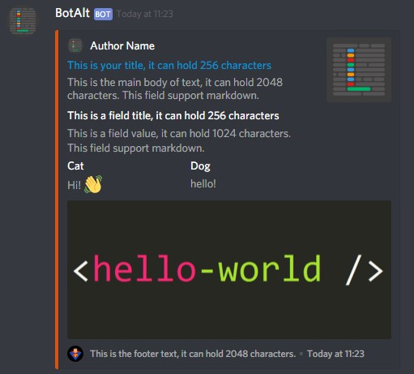

# basic-bot-discord
A basic template for creating a Discord bot made with discord.js

### `ping` command

### `embed` command

### `purge` command
Deletes a custom amount of messages (limited to 100 messages)

### `private` command
Send to you a private message

### `webhook` command
Send a webhook
